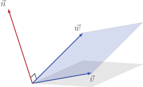

# Cross product

If we have two vectors in $3$ dimensions, their **cross product**
$\vec{u} \times \vec{v}$ gives a third vector $\vec{n}$ which is perpendicular
to both $\vec{u}$ and $\vec{v}$.

It turns out that the correct components for this vector are

$$
\vec{n} = \vec{u} \times \vec{v} =
\begin{bmatrix}
u_2 v_3 - u_3 v_2 \\ u_3 v_1 - u_1 v_3 \\ u_1 v_2 - u_2 v_1
\end{bmatrix}
$$

It's a pretty fun exercise to **check** that

$$
\begin{aligned}
\vec{n} \cdot \vec{u} & = 0 \\
\vec{n} \cdot \vec{v} & = 0
\end{aligned}
$$

It's less fun to **derive** $\vec{u} \times \vec{v}$ from scratch, but if you
really want to know how we could ever have come up with this normal vector, I'll
see you in the box.

::: details

Curious one, aren't you!

To ensure that $\vec{n}$ is perpendicular to $\vec{u}$ and $\vec{v}$, it
[is enough](./orthogonality) to make sure that the dot product is $0$

$$
\begin{aligned}
\vec{n} \cdot \vec{u} & = 0 \\
\vec{n} \cdot \vec{v} & = 0
\end{aligned}
$$

In terms of components, this means we need

$$
\begin{aligned}
n_1 u_1 + n_2 u_2 + n_3 u_3 & = 0 \\
n_1 v_1 + n_2 v_2 + n_3 v_3 & = 0
\end{aligned}
$$

We're going to solve, using simultaneous equations, to find $\vec{n}$. First up,
let's eliminate $n_2$ by multiplying the top equation by $v_2$ and the bottom
equation by $u_2$, then subtracting.

$$
\begin{aligned}
&& n_1 u_1 v_2 + n_2 u_2 v_2 + n_3 u_3 v_2 & = 0 \\
(-) && n_1 u_2 v_1  + n_2 u_2 v_2 + n_3 u_2 v_3 & = 0 \\
\Rightarrow && n_1 (u_1 v_2 - u_2 v_1) + n_3 (u_3 v_2 - u_2 v_3) & = 0
\end{aligned}
$$

Rearranging, we find

$$
n_1 = n_3 \frac{u_2 v_3 - u_3 v_2}{u_1 v_2 - u_2 v_1}
$$

I'll omit some of the details, but you may check that eliminating $n_1$ also
gives

$$
n_2 = n_3 \frac{u_3 v_1 - u_1 v_3}{u_1 v_2 - u_2 v_1}
$$

Since there are two equations and three unknowns, we can let $n_3$ be anything
we like (except $0$). As you can see, it would be most convenient if
$n_3 = u_1 v_2 - u_2 v_1$, in which case we get

$$
\vec{n} = \begin{bmatrix}
u_2 v_3 - u_3 v_2 \\ u_3 v_1 - u_1 v_3 \\ u_1 v_2 - u_2 v_1
\end{bmatrix}
$$

:::

## Code

Let's get this into our class before my head explodes.

::: code-group

<<< @/../pycode/models/vector_test.py#test_vector_cross_product

<<< @/../pycode/models/vector.py#vector_cross_product

:::

## Exercise

<Exercise id="cross-product" />
