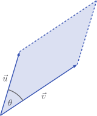

# $2$ dimensions

Let's suppose the below parallelogram is formed from $2$-dimensional vectors.

If the vectors are $2$-dimensional, the formula

$$
\text{Area} = \sqrt{ |\vec{u}|^2 |\vec{v}|^2 - (\vec{u} \cdot \vec{v})^2}
$$

simplifies to

$$
\text{Area} = |u_1 v_2 - u_2 v_1|
$$

::: details

We have

$$
\begin{aligned}
\text{Area}^2
& = (\vec{u} \cdot \vec{u}) (\vec{v} \cdot \vec{v}) - (\vec{u} \cdot \vec{v})^2 \\
& = (u_1^2 + u_2^2)(v_1^2 + v_2)^2 - (u_1 v_1 + u_2 v_2)^2 \\
& = \cancel{u_1^2 v_1^2} + u_1^2 v_2^2 + u_2^2 v_1^2 + \cancel{u_2^2 v_2^2}
- \cancel{u_1^2 v_1^2} - 2 u_1 v_2 u_2 v_1 - \cancel{u_2^2 v_2^2} \\
& = (u_1 v_2 - u_2 v_1)^2
\end{aligned}
$$

and taking square roots, we're left with

$$
\begin{aligned}
\text{Area}
& = \sqrt{(u_1 v_2 - u_2 v_1)^2} \\
& = |u_1 v_2 - u_2 v_1|
\end{aligned}
$$

:::

This is a pretty famous formula.

## Signed area

If we remove the absolute value, we get

$$
u_1 v_2 - u_2 v_1
$$

which is known as the **signed area** of the parallelogram. If we picked up the
parallelogram and flipped it over, the area of the parallelogram would not
change, but the **signed area** would become negative.

