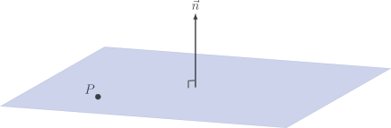
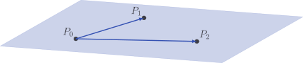
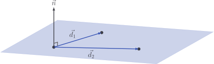

# Plane through three points

We have seen that a plane can be specified by two properties: any point $P$
which sits in the plane, and any vector $\vec{n}$ which is normal to it.

Sometimes, we aren't handed this information up front, and we have a bit of work
to do first. We're going to add a factory method to `Plane` which allows us to
create instances of `Plane` given $3$ points - $P_0$, $P_1$ and $P_2$.

If we let $\vec{d_1}$ be the vector from $P_0$ to $P_1$ and $\vec{d_2}$ be the
vector from $P_0$ to $P_1$, then we can compute the normal vector $\vec{n}$
using the [cross product](../vectors/cross-product):

$$
\vec{n} = \vec{d_1} \times \vec{d_2}
$$

## Code

This should be enough to get a factory method into our `Plane` class.

::: code-group

<<< @/../pycode/models/plane.py#plane_from_points

:::
