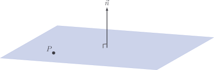

# Planes

A **plane** is a flat shape floating in space, like an infinite piece of paper.
It has no curves and no edges, it just extends out in never-ending flatness.

The main problem we'd like to solve when it comes to planes is, given some point
$Q$ and some plane $\Pi$, does $Q$ belong to $\Pi$, or is it floating off above
or below it?

It's perhaps a bit surprising that we only need two bits of information to
determine this:

1. A point $P$ which we know _does_ lie in the plane

1. A vector $\vec{n}$ which is normal (perpendicular) to the plane

A point $Q$ lies in the plane if, and only if, the vector $\vec{PQ}$ that points
from $P$ to $Q$ is perpendicular to $\vec{n}$. This is the case if, and only if,
their [dot product](../vectors/subtracting-vectors) is zero:
$\vec{n} \cdot \vec{PQ} = 0$.

If the position vectors of $P$ and $Q$ are $\vec{p}$ and $\vec{q}$, then the
vector from $P$ to $Q$ is given by $\vec{q} - \vec{p}$.

::: tip Vector equation of a plane

The point $Q$ lies in the plane $\Pi$ if, and only if,

$$
\vec{n} \cdot \left( \vec{q} - \vec{p} \right) = 0
$$

where:

- $\vec{q}$ is the position vector of $Q$
- $\vec{p}$ is the position vector of some point $P \neq Q$ lying in the plane
- $\vec{n}$ is any vector normal to the plane

:::

## Example

Let $\Pi$ be the plane passing through $P(2, 0, -1)$ with normal vector

$$
\vec{n} = \begin{bmatrix} 4 \\ 1 \\ 3 \end{bmatrix}
$$

Which of the points $(1, -1, 2)$ and $(0, 2, 1)$ lie on $\Pi$?

Let's check $(1, -1, 2)$ first:

$$
\begin{aligned}

\vec{n} \cdot \left( \vec{q} - \vec{p} \right)

& = \begin{bmatrix} 4 \\ 1 \\ 3 \end{bmatrix} \cdot \left( \begin{bmatrix} 1 \\ -1 \\ 2 \end{bmatrix} - \begin{bmatrix} 2 \\ 0 \\ -1 \end{bmatrix} \right) \\[5pt]

& = \begin{bmatrix} 4 \\ 1 \\ 3 \end{bmatrix} \cdot \begin{bmatrix} -1 \\ -1 \\ 3 \end{bmatrix} \\[5pt]

& = -4 - 1 + 6 \\[5pt]

& = 1

\end{aligned}
$$

We did not get $0$, so this point **does not** lie on the plane.

Let's check $(0, 2, 1)$:

$$
\begin{aligned}

\vec{n} \cdot \left( \vec{q} - \vec{p} \right)

& = \begin{bmatrix} 4 \\ 1 \\ 3 \end{bmatrix} \cdot \left( \begin{bmatrix} 0 \\ 2 \\ 1 \end{bmatrix} - \begin{bmatrix} 2 \\ 0 \\ -1 \end{bmatrix} \right) \\[5pt]

& = \begin{bmatrix} 4 \\ 1 \\ 3 \end{bmatrix} \cdot \begin{bmatrix} -2 \\ 2 \\ 2 \end{bmatrix} \\[5pt]

& = -8 + 2 + 6 \\[5pt]

& = 0

\end{aligned}
$$

so this point **does** lie on the plane.

## Code

Let's kick off a `Plane` class. We will refer to the point $P$ as the "origin"
of the plane, because points within the plane are given relative to this point.

::: code-group

<<< @../../pycode/models/plane_test.py#plane_init

<<< @../../pycode/models/plane.py#plane_init

:::

Apart from the two essential properties, we also want to check if some given
point belongs to the plane. We'll implement `__contains__` so we get access to
the `in` operator.

::: code-group

<<< @../../pycode/models/plane_test.py#plane_contains

<<< @../../pycode/models/plane.py#plane_contains

:::

## Exercise

<Exercise id="" />
