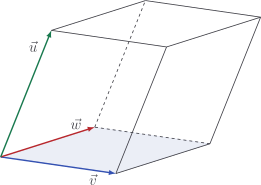
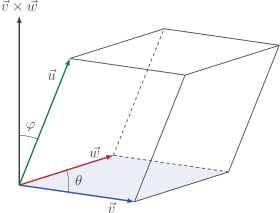

# Triple product

We've seen how to find the area of a parallelogram given by two vectors. If
we're given three vectors, however, they determine a **parallelepiped**.



A parallelepiped is a bit like a wonky cube. We're interested to find the
**volume** of this shape. It turns out that there's a rather beautiful formula
for it:

$$
\text{Volume} = \vec{u} \cdot \left( \vec{v} \times \vec{w} \right)
$$

::: details

Let's label a few things on our picture.



The vector $\vec{v} \times \vec{w}$ is perpendicular to $\vec{v}$ and $\vec{w}$.
The height of the parallelepiped is therefore $|\vec{u}|\cos\varphi$, and the
volume is

$$
\begin{aligned}
\text{Volume} & = \text{Area of base} \times \text{height} \\
& = |\vec{v}||\vec{w}|\sin\theta \times |\vec{u}|\cos\varphi \\
& = |\vec{v} \times \vec{w}| |\vec{u} | \cos \varphi \\
& = \vec{u} \cdot (\vec{v} \times \vec{w})
\end{aligned}
$$

Here, we have used that

$$
|\vec{v} \times \vec{w}| = |\vec{v}||\vec{w}|\sin\theta
$$

which is explained [here](./cross-product-area).

:::

This is known as the **triple product** of the vectors.

## Code

With this, we're able to generalise our `vol` method a bit further!

::: code-group

<<< @/../pycode/models/vector_test.py#test_vector_triple_product

```py [vector.py]
def vol(cls, vectors: list[Vector]) -> float:
    dim = len(vectors)

    if any(v.dim != dim for v in vectors):
        raise ValueError("Require n vectors in n dimensions")

    if dim == 2:
        u, v = vectors
        return u @ v.perp()

    if dim == 3: # [!code ++:3]
        u, v, w = vectors
        return u @ Vector.cross([u, v])
```

:::

## Exercise

<Exercise id="triple-product" />
