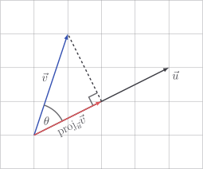

# Vector projections

Imagine shining a light on $\vec{v}$ so that it casts a shadow on $\vec{u}$.

The shadow is a vector, which represents something like "what part of $\vec{v}$
points along $\vec{u}$?" It's known formally as the **projection** of $\vec{v}$
onto $\vec{u}$ and is calculated by the formula

$$
\text{proj}_{\vec{u}} \vec{v}
= \frac{\vec{v} \cdot \vec{u}}{|\vec{u}|^2} \, \vec{u}
$$

::: tip

[Recall](../vectors/dot-prod-properties#vector-magnitude) that
$|\vec{u}|^2 = \vec{u} \cdot \vec{u}$. The above formula is more convenient to
compute as

$$
\text{proj}_{\vec{u}} \vec{v}
= \frac{\vec{v} \cdot \vec{u}}{\vec{u} \cdot \vec{u}} \, \vec{u}
$$

:::

::: details

The magnitude of this projection is found through basic trigonometry to be
$|\vec{v}| \cos \theta$, and its direction is
$\hat{u} = \frac{\vec{u}}{|\vec{u}|}$, and so we find that

$$
\text{proj}_{\vec{u}} \vec{v}
= \left(|\vec{v}| \cos \theta \right) \, \frac{\vec{u}}{|\vec{u}|} \\
$$

Although correct, this isn't exactly convenient, especially because we don't
want to deal with $\theta$ all the time. Good news! In our study of
[cosine similarity](./cosine-similarity) we realised that

$$
\cos \theta = \frac{\vec{v} \cdot \vec{u}}{|\vec{v}||\vec{u}|}
$$

and so

$$
\begin{aligned}
\text{proj}_{\vec{u}} \vec{v}

& = \left(\cancel{|\vec{v}|}  \frac{\vec{v} \cdot \vec{u}}{\cancel{|\vec{v}|}|\vec{u}|} \right) \, \frac{\vec{u}}{|\vec{u}|} \\[5pt]

& = \frac{\vec{v} \cdot \vec{u}}{|\vec{u}|^2} \, \vec{u} \\[5pt]

& = \frac{\vec{v} \cdot \vec{u}}{\vec{u} \cdot \vec{u}} \, \vec{u}
\end{aligned}
$$

which is slightly more practical to compute, especially by hand.

:::

## Example

For example, let

$$
\vec{u} = \begin{bmatrix} 4 \\ 2 \end{bmatrix} \quad \vec{v} = \begin{bmatrix} 1 \\ 3 \end{bmatrix}
$$

Then the projection of $\vec{v}$ onto $\vec{u}$ is

$$
\begin{aligned}
\text{proj}_{\vec{u}} \vec{v}

& = \frac{\vec{v} \cdot \vec{u}}{\vec{u} \cdot \vec{u}} \, \vec{u} \\[5pt]

& = \frac{1 \times 4 + 3 \times 2}{4^2 + 2^2} \, \begin{bmatrix} 4 \\ 2 \end{bmatrix} \\[5pt]

& = \frac{1}{2} \, \begin{bmatrix} 4 \\ 2 \end{bmatrix} \\[5pt]

& = \begin{bmatrix} 2 \\ 1 \end{bmatrix} \\[5pt]
\end{aligned}
$$

If you count the squares in the image at the top of the page, you'll see that
this seems like the correct answer.

## Code

For our implementation in `Vector`, I'll choose `v.proj(u)` to mean "project `v`
onto `u`" as that's how I think about it.

::: code-group

<<< @/../pycode/models/vector_test.py#test_vector_projection

<<< @/../pycode/models/vector.py#vector_projection

:::

## Exercise

<Exercise id="vector-projections" />
