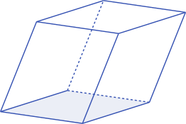

# Volumes

We're now going to spend too long worrying about the amount of space inside a
thing.

In $1$ dimension, this quantity is called _length_, and we care especially about
the length of a _line_.

In $2$ dimensions, it is called _area_, and we're concerned with
_parallelograms_.


In $3$ dimensions, it is called _volume_, and the shape under examination is the
$3$-dimensional version of a parallelogram, the _parallelepiped_.



In higher dimensions, these equivalent shapes get called _parallelotopes_. We
can still talk about the amount of space they contain, but we can't really draw
the things in the same way.

We'll allow the word **volume** to refer to all of the above, mostly because we
don't want a separate function for every dimension.

## Code

Let's kick off our `vol` function by getting the "volume" of a single vector in
$1$ dimension. This is really silly: we're saying the volume of the vector
$\vec{v} = \begin{bmatrix} 3 \end{bmatrix}$ is $3$. As we'll soon see, this is
the base case of a recursive function, and those often look silly and trivial,
so let's not get too hung up about it.

::: code-group

<<< @/../pycode/models/vector_test.py#test_vol_1d

```py [vector.py]
@classmethod
def vol(cls, vectors: Iterable[Vector]) -> float:
    vectors = list(vectors)
    dim = len(vectors)

    if any(v.dim != dim for v in vectors):
        raise ValueError("Require n vectors in n dimensions")

    if dim == 1:
        [v] = vectors
        return v[0]
```

:::
