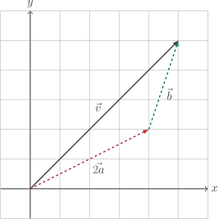
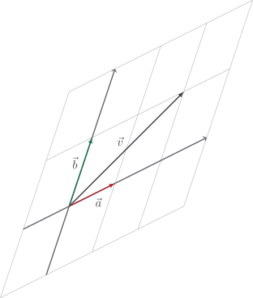
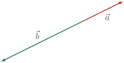

# Linear combinations

Let's take two vectors at pretty much random:

$$
\vec{a} = \begin{bmatrix} 2 \\ 1 \end{bmatrix} \quad \vec{b} = \begin{bmatrix} 1 \\ 3 \end{bmatrix}
$$

Using scaling and addition, we can create new vectors. For example,

$$
\begin{aligned}
\vec{v}
& = 2 \vec{a} + \vec{b} \\
& = \begin{bmatrix} 5 \\ 5 \end{bmatrix}
\end{aligned}
$$

Such a thing is called a **linear combination** of $\vec{a}$ and $\vec{b}$. This
linear combination be illustrated in a diagram, too.

In fact, the vectors $\vec{a}$ and $\vec{b}$ can more or less replace the
$xy$-plane to form their own coordinate system. Here's how the $ab$-plane looks:

This picture should convince you that _any_ point in space could be described as
some linear combination of $\vec{a}$ and $\vec{b}$. This is a pretty important
concept which we expand upon in [basis vectors]().

Of course, if $\vec{a}$ and $\vec{b}$ happened to be parallel, we're in trouble
because we can't actually get off the direction they both lie in!

::: tip

In this case, we would find that $|\vec{a} \times \vec{b}| = 0$ because the
parallelogram they form has area $0$. The cross product is good at detecting
parallel vectors.

:::

As far as our codebase is concerned, there's nothing to actually implement here,
because all we're talking about is addition and scaling. The conversation has
been pretty academic. However, it's a good idea to add a test case to ensure
adding and scaling integrate properly.

<<< @/../pycode/models/vector_test.py#test_linear_combination

Technically, we already made use of linear combinations when we implemented
vector subtraction. I won't tell anyone if you don't.

## Exercise

<Exercise id="linear-combinations" />
