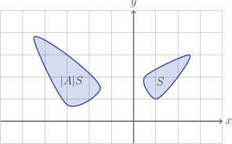
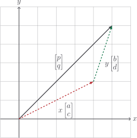
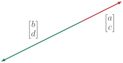

# Determinants

Things are about to get _weird_.

It turns out that, for the matrix

$$
A = \begin{bmatrix} a & b \\ c & d \end{bmatrix}
$$

the number

$$
|A| = ad - bc
$$

is _really, really important_. So important, in fact, that we give it a special
name: the **determinant**. If you squint and tilt your head, you might see that
$|A|$ is the [cross product](../vectors/cross-product-2d.md) of the columns of
$A$.

Before I start jabbering on about parallelograms, let's write the code.

::: code-group

<<< @/../pycode/models/matrix_test.py#test_matrix_det_2d

<<< @/../pycode/models/matrix.py#matrix_det_2d

:::

## Geometric interpretation

Take two vectors, $\vec{u}$ and $\vec{v}$. We know that the area of the
parallelogram is given by their [cross product](../vectors/cross-product-2d.md)

$$
\vec{u} \times \vec{v} = u_1 v_2 - u_2 v_1
$$

Well, if we transform both vectors by $A$, then the area of the new
parallelogram is

$$
|A| \left(\vec{u} \times \vec{v}\right)
$$

::: details

Let's do this.

$$
\begin{aligned}
A \vec{u} \times A \vec{v}

& =
\begin{bmatrix} a u_1 + b u_2 \\ c u_1 + d u_2 \end{bmatrix}
\times
\begin{bmatrix} a v_1 + b v_2 \\ c v_1 + d v_2 \end{bmatrix} \\[6pt]

& = (a u_1 + b u_2)(c v_1 + d v_2) - (c u_1 + d u_2)(a v_1 + b v_2)  \\[6pt]

& = a c u_1 v_1 + a d u_1 v_2 + b c u_2 v_1 + b d u_2 v_2  \\
& \quad - a c u_1 v_1 - b d u_2 v_2 - a d u_2 v_1 - b d u_2 v_2  \\[6pt]

& = ad(u_1v_2 - u_2v_1) - bd(u_1v_2 - u_2v_1)  \\[6pt]

& = (ad - bc)(u_1v_2 - u_2v_1)  \\[6pt]

& = |A| \left(\vec{u} \times \vec{v}\right)

\end{aligned}
$$

:::

In other words, if you need $S$ paint to cover a shape, and you transform every
point in that shape by $A$, you now need $|A|S$ paint to cover the new shape.

::: tip

Transforming space by $A$ dilates areas by $|A|$.

:::

## Algebraic interpretation

The solutions of the simultaneous equations

$$
\begin{cases}
ax + by = p \\
cx + dy = q
\end{cases}
$$

are

$$
x = \frac{dp - bq}{ad - bc} \quad y = \frac{aq - cp}{ad - bc}
$$

::: details

To eliminate $y$, we multiply the top equation by $d$ and the bottom equation by
$b$, then subtract them

$$
\begin{aligned}
&& adx + bdy & = dp \\
- && bcx + bdy & = bq \\[6pt]
&& (ad - bc) x & = dp - bq \\[6pt]
\Rightarrow && x & = \frac{dp - bq}{ad - bc}
\end{aligned}
$$

To eliminate $x$, we multiply the top equation by $c$ and the bottom equation by
$a$, then subtract them

$$
\begin{aligned}
&& acx + bcy & = cp \\
- && acx + ady & = aq \\[6pt]
&& (bc - ad) y & = cp - aq \\[6pt]
\Rightarrow && y & = \frac{aq - cp}{ad - bc}
\end{aligned}
$$

:::

What's that in the denominator of our solutions? The freakin' **determinant**!
And notice that the solution can be _determined_ if, and only if, the
_determinant_ is not $0$ because we can't divide by $0$.

::: tip

The simultaneous equations

$$
\begin{cases}
ax + by = p \\
cx + dy = q
\end{cases}
$$

can be solved for unique $x, y$ if, and only if, $ad - bc \neq 0$.

:::

## Unified interpretation

I like to have a grand theory of everything. Just why should the determinant
have such important "interpretations" in two apparently very different contexts?
There _must_ be some connection.

Our simultaneous equations

$$
\begin{cases}
ax + by = p \\
cx + dy = q
\end{cases}
$$

could just as well be written using [vector scaling](../vectors/scaling-vectors)
as

$$
  x \begin{bmatrix} a \\ c \end{bmatrix}
+ y \begin{bmatrix} b \\ d \end{bmatrix}
= \begin{bmatrix} p \\ q \end{bmatrix}
$$

What the simultaneous equations are asking for, then, is a
[linear combination](../vectors/linear-combinations) of
$\begin{bmatrix} a \\ c \end{bmatrix}$ and
$\begin{bmatrix} b \\ d \end{bmatrix}$ that equals some other vector
$\begin{bmatrix} p \\ q \end{bmatrix}$.

But here's the thing,

$$
|A| = \begin{bmatrix} a \\ c \end{bmatrix} \times \begin{bmatrix} b \\ d \end{bmatrix}
$$

the area of the parallelogram. If $|A| = 0$ then the parallelogram has $0$ area:
this means we're stuck on a bloody line!

So _of course_ we can't get to some other random point $(p, q)$. $A$ has
collapsed our $xy$-plane into a line.
