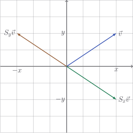
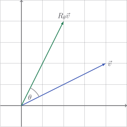
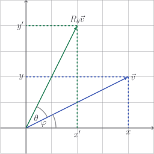

# Special transformations

There are a couple of important transformation matrices which are worth getting
to know on a personal level.

## Identity

The matrices

$$
I_2 = \begin{bmatrix} 1 & 0 \\ 0 & 1 \end{bmatrix}, \quad I_3 = \begin{bmatrix} 1 & 0 & 0 \\ 0 & 1 & 0 \\ 0 & 0 & 1 \end{bmatrix}, \quad \ldots
$$

are called the **identity** matrices. They leave any vector completely
unchanged:

$$
\begin{bmatrix} 1 & 0 \\ 0 & 1 \end{bmatrix} \begin{bmatrix} 3 \\ 2 \end{bmatrix} = \begin{bmatrix} 3 \\ 2 \end{bmatrix}
$$

Generally,

$$
I \, \vec{v} = \vec{v}
$$

Let's chuck a static method into our class to create identity matrices.

::: code-group

<<< @/../pycode/models/matrix_test.py#test_identity_matrix

<<< @/../pycode/models/matrix.py#identity_matrix

:::

## Scaling

Note that

$$
\begin{bmatrix} 7 & 0 \\ 0 & 7 \end{bmatrix} \begin{bmatrix} x \\ y\end{bmatrix} = \begin{bmatrix} 7x \\ 7y \end{bmatrix}
$$

which is basically just the same as scalar multiplication. We will see soon that
it makes sense to write $7I$ to represent this vector, but not straight away as
we haven't even defined the operation of multiplying a matrix by a number yet.

## Reflecting

The matrices

$$
S_x = \begin{bmatrix} 1 & 0 \\ 0 & -1 \end{bmatrix},
\quad S_y = \begin{bmatrix} -1 & 0 \\ 0 & 1 \end{bmatrix}
$$

will reflect any $2$-dimensional vector in the $x$-axis and $y$-axis
respectively. To see why, consider

$$
\begin{bmatrix} 1 & 0 \\ 0 & -1 \end{bmatrix} \begin{bmatrix} x \\ y \end{bmatrix} = \begin{bmatrix} x \\ -y \end{bmatrix}
$$

When the $y$-coordinate of a point is replaced with $-y$, the point is being
reflected in the $x$-axis.

## Rotating

The matrix

$$
R_{\theta} = \begin{bmatrix} \cos \theta & - \sin \theta \\ \sin \theta & \cos \theta \end{bmatrix}
$$

will rotate any $2$ dimensional matrix by $\theta$ in the anticlockwise
direction.

Want to know why?

::: details

Let's label a few things.

By basic trigonometry,

$$
\begin{aligned}
x & = |\vec{v}| \cos \varphi \\
y & = |\vec{v}| \sin \varphi \\
\end{aligned}
$$

Let's calculate $x'$:

$$
\begin{aligned}
x'
& = |\vec{v}| \cos(\varphi + \theta) \\
& = |\vec{v}| (\cos \varphi \cos \theta - \sin \varphi \sin \theta) \\
& = |\vec{v}| \cos \varphi \cos \theta - |\vec{v}| \sin \varphi \sin \theta \\
& = x \cos \theta - y \sin \theta
\end{aligned}
$$

And $y'$:

$$
\begin{aligned}
y'
& = |\vec{v}| \sin(\varphi + \theta) \\
& = |\vec{v}| (\cos \varphi \sin \theta + \sin \varphi \cos \theta) \\
& = |\vec{v}| \cos \varphi \sin \theta + |\vec{v}| \sin \varphi \cos \theta \\
& = x \sin \theta + y \cos \theta
\end{aligned}
$$

This tells us that

$$
\begin{aligned}
R_\theta \vec{v}
& = \begin{bmatrix} x' \\ y' \end{bmatrix} \\
& = \begin{bmatrix} x \cos \theta - y \sin \theta \\ x \sin \theta + y \cos \theta \end{bmatrix} \\
& = \begin{bmatrix} \cos \theta & - \sin \theta \\ \sin \theta & \cos \theta \end{bmatrix} \begin{bmatrix} x \\ y \end{bmatrix}
\end{aligned}
$$

Hence

$$
R_\theta = \begin{bmatrix} \cos \theta & - \sin \theta \\ \sin \theta & \cos \theta \end{bmatrix}
$$

:::

## Combinations

We can even combine these fellas to move vectors around will-he-nil-he. for
example, let's rotate the vector $\begin{bmatrix} 4 \\ 2 \end{bmatrix}$ by
$30^{\circ}$ and then reflect in the $x$-axis:

$$
\begin{aligned}
S_x R_{30^{\circ}} \vec{v}

& =
\begin{bmatrix} 1 & 0 \\ 0 & -1 \end{bmatrix}
\begin{bmatrix} \cos 30^{\circ} & - \sin 30^{\circ} \\ \sin 30^{\circ} & \cos 30^{\circ} \end{bmatrix}
\begin{bmatrix} 4 \\ 2 \end{bmatrix} \\

& =
\begin{bmatrix} 1 & 0 \\ 0 & -1 \end{bmatrix}
\begin{bmatrix} \frac{\sqrt{3}}{2} & - \frac{1}{2} \\ \frac{1}{2} & \frac{\sqrt{3}}{2} \end{bmatrix}
\begin{bmatrix} 4 \\ 2 \end{bmatrix} \\

& =
\begin{bmatrix} 1 & 0 \\ 0 & -1 \end{bmatrix}
\begin{bmatrix} 2\sqrt{3} - 1 \\ 2 - \sqrt{3} \end{bmatrix} \\

& =
\begin{bmatrix} 2\sqrt{3} - 1 \\ \sqrt{3} - 2 \end{bmatrix} \\

\end{aligned}
$$

This is the basis of how most computer animation works.

## Exercise

<Exercise id="special-transformations" />
