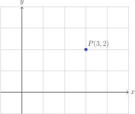
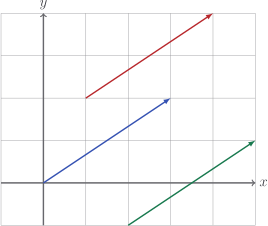

# Components and dimensions

On the left is a point, on the right is a vector:

$$
P(3, 2) \qquad \vec{v} = \begin{bmatrix} 3 \\ 2 \end{bmatrix}
$$

On the face of it, there is very little difference between them. They both just
look like tuples of numbers. Here's one way to look at it: although the
**properties** look the same, the class of vectors has a much richer set of
**behaviours**.

We think of a coordinate as being just a point in space:



But a vector doesn't have to start at the origin:



All of these are the vector $\begin{bmatrix} 3 \\ 2 \end{bmatrix}$, they all say
_go three in the $x$ direction and two in the $y$ direction_. Vectors which do
start at the origin are called **position vectors**.

A vector is often described as a "directed quantity", which means it has

- a **size** (or _magnitude_)
- a **direction** (or _argument_)

If you use negative and positive numbers, you already use directed quantities,
just with the restricted directions of _positive_ and _negative_. Well, with
vectors now we have a great many more directions to choose from.

We usually write vectors vertically. The values $3$ and $2$ are called the
**components** of the vector. With this in mind, let's start our vector class.

::: code-group

```python [vector_test.py]
def test_vector_components():
    v = Vector(3, 2)

    assert v.x == 3
    assert v.y == 2
```

```python [vector.py]
class Vector:
    def __init__(self, x: float, y: float):
        self.x = x
        self.y = y
```

:::

::: tip

I'll generally put the test cases first. Feel free to think up or code an
implementation, if you like. Click the `vector.py` tab to see mine.

:::

The **dimension** of a vector is just the number of components it has. The
vectors

$$
\begin{bmatrix}
x \\ y
\end{bmatrix}

\quad

\begin{bmatrix}
x \\ y \\ z
\end{bmatrix}
$$

are $2$ and $3$ dimensional, respectively. We can have $n$-dimensional vectors,
with $n$ components. At this point, we should give up on the alphabet and use
subscript notation.

$$
\vec{v} = \begin{bmatrix}
v_1 \\ v_2 \\ \vdots \\ v_n
\end{bmatrix}
$$

Our `Vector` class is hard-coded to two dimensions, which is pretty dumb. Let's
refactor it. From now on, when it's clear we're working in the `Vector` class,
I'll omit the class declaration.

::: code-group

<<< @/../pycode/models/vector_test.py#test_vector_components

<<< @/../pycode/models/vector.py#vector_init

:::

What else? Let's make sure `len(v)` works for our vectors, so we can find out
their dimensions. Also, let's make sure we can get at our components with things
like `v[i]`, and loop through our components easily:

::: code-group

<<< @/../pycode/models/vector_test.py#test_vector_dimension

<<< @/../pycode/models/vector.py#vector_dimension

:::

::: warning

You will notice that the component $v_1$ is given by `v[0]` and so on. This is
just the godforsaken world we live in.

:::

Finally, let's ensure that two vectors are considered equal if they have the
same components:

::: code-group

<<< @/../pycode/models/vector_test.py#test_vector_equality

<<< @/../pycode/models/vector.py#vector_equality

:::

## Exercise

<Exercise id="components-and-dimensions" />
