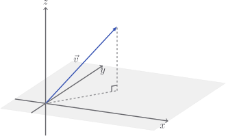

# Components and dimensions

A vector is pretty much a tuple with a bunch of extra methods and a few
centuries of psychological baggage. We're fairly accustomed to the idea of
taking a list of stuff and adding extra behaviour: stacks, queues , yada yada.
So vectors aren't really all that different.

I'll be introducing vectors (and matrices) geometrically, so let's get one thing
cleared up. On the left is a point, on the right is a vector:

$$
P(3, 2) \qquad \vec{v} = \begin{bmatrix} 3 \\ 2 \end{bmatrix}
$$

Although the **properties** look the same, the class of vectors has a much
richer set of **behaviours**.

We think of a coordinate as being just a point in space:

But we think of a vector as an arrow:

All of these are the vector $\begin{bmatrix} 3 \\ 2 \end{bmatrix}$, they all say
_go three in the $x$ direction and two in the $y$ direction_. The values $3$ and
$2$ are called the **components** of the vector. With this in mind, let's start
our vector class.

::: code-group

<<< @/../pycode/models/vector_test.py#test_vector_components

<<< @/../pycode/models/vector.py#vector_init

:::

::: tip

I'll generally put the test cases first. Feel free to think up or code an
implementation, if you like. Click the `vector.py` tab to see mine. My code will
be pretty shitty, but these docs are about math for devs not the other way
round - however, if it gets _too shitty to ignore_ do make a pull request, and
thanks in advance.

:::

The **dimension** of a vector is just the number of components it has. The
vector

$$
\vec{v} = \begin{bmatrix}
x \\ y \\ z
\end{bmatrix}
$$

is $3$-dimensional, and can be drawn on $x, y, z$ axes.

We can even have $n$-dimensional vectors, with $n$ components. At this point, we
should give up on the alphabet and use subscript notation.

$$
\vec{v} = \begin{bmatrix}
v_1 \\ v_2 \\ \vdots \\ v_n
\end{bmatrix}
$$

Let's make sure we can easily get to the dimension and components of our
vectors, as well as loop through the components.

::: code-group

<<< @/../pycode/models/vector_test.py#test_vector_items

<<< @/../pycode/models/vector.py#vector_items

:::

::: warning

You will notice that the component $v_1$ is given by `v[0]` and so on. This is
just the godforsaken world we live in.

:::

Finally, let's ensure that two vectors are considered equal if they have the
same components:

::: code-group

<<< @/../pycode/models/vector_test.py#test_vector_equality

<<< @/../pycode/models/vector.py#vector_equality

:::

## Exercise

<Exercise id="components-and-dimensions" />
