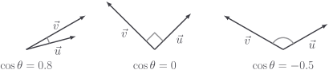
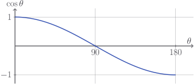

# Cosine similarity

The [dot product](/learn/vectors/dot-product) is given by

$$
\vec{u} \cdot \vec{v} = |\vec{u}| |\vec{v}| \cos \theta
$$

A very useful consequence is that

$$
\cos \theta = \frac{\vec{u} \cdot \vec{v}}{|\vec{u}| |\vec{v}|}
$$

The hawk-eyed among you might even notice that
$\frac{\vec{u}}{|\vec{u}|} = \hat{u}$ is a
[unit vector](../vectors/unit-vectors), and similar for $\vec{v}$, so we could
write

$$
\cos \theta = \hat{u} \cdot \hat{v}
$$

The value of $\cos \theta$ measures how much the vectors appear to point in the
same direction, i.e. how similar they are irrespective of their magnitude.



The value of $\cos \theta$ is sometimes called the **cosine similarity**.

- Parallel vectors have a cosine similarity of $1$

- Perpendicular vectors have a cosine similarity of $0$

- Antiparallel vectors have a cosine similarity of $-1$



## Code

This seems important enough - let's get cosine similarity into `Vector`.

::: code-group

<<< @/../pycode/models/vector_test.py#test_vector_cosine

<<< @/../pycode/models/vector.py#vector_cosine

:::

## Exercise

<Exercise id="cosine-similarity" />

## Application

Suppose we had some samples of handwriting like

<div style="display: flex; justify-content: center; width: 100%; align-items: center; gap: 1rem;">
  
  
  
</div>

Each one of these images is made up of $784$ pixels, and each pixel can be
assigned a brightness between $0$ (black) and $255$ (white). If we read these
images into our code, we can convert the list of pixels into a vector. For
example,

```python
im9a = Image.open(images / "mnist_9a.png")
v9a = Vector(im9a.getdata())

print(v9a) # Vector(... 0, 80, 244, 254, 176, 2, 0, ...)
```

The vectors have $784$ dimensions. Now that they are `Vector`s, we can compute
the cosine similarities.

```python
print(v9a.cosine(v9b))  # 0.582...
print(v9a.cosine(v5))  # 0.373...
```

As we can see, the two pictures depicting a $9$ are more similar to each other
than they are to the $5$. The great thing is that the cosine similarity won't
change due to changes in the overall brightness of the image - if we scaled down
the brightness of `im9a` then its cosine similarity to `im9b` wouldn't change at
all. This is because "overall brightness" of our image vectors is equivalent to
their magnitude. On the other hand, sliding all the pixes to the left a bit
would have a profound effect on the cosine similarity.
