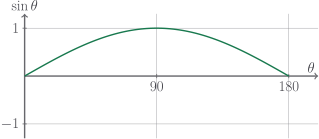
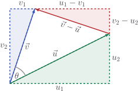
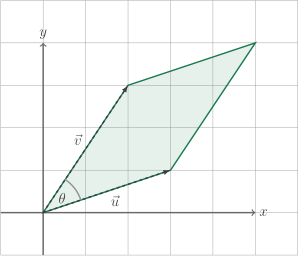

# Cross product in 2D

The dot product has hogged all the glory so far. It's pretty cool. But, as we
have alluded, it's not the only product of vectors we can define. We focused on
cosine, because $\cos\theta$ rewards parallel vectors and punishes perpendicular
ones. But why couldn't that be the other way round?

If we wanted to reward two vectors for being more perpendicular, we should
instead choose $\sin \theta$, which is clear from the graph:

Our formula, then, is

$$
\vec{u} \times \vec{v} = |\vec{u}| |\vec{v}| \sin \theta
$$

We call this the **cross product** and give it the operator symbol $\times$ to
help distinguish it from the dot product.

## Calculating the 2D cross product

As with the dot product, however, measuring $\theta$ with a protractor to
calculate the cross product is rubbish and we don't want to do it. If only there
were a pretty formula...

::: details

We compute the area of this rectangle in two ways. On the one hand, it is
obviously

$$
u_1 v_2
$$

On the other hand, we could add together the areas of the four triangles:

$$
\frac{|\vec{u}| |\vec{v}| \sin \theta}{2} + \frac{u_1 u_2}{2} + \frac{v_1 v_2}{2} + \frac{(u_1 - v_1)(v_2 - u_2)}{2}
$$

These quantities are equal, as they both represent the area, so

$$
\begin{aligned}
2 u_1 v_1 & = |\vec{u}| |\vec{v}| \sin \theta + u_1 u_2 + v_1 v_2 + (u_1 - v_1)(v_2 - u_2) \\
2 u_1 v_1 & = |\vec{u}| |\vec{v}| \sin \theta + u_1 u_2 + v_1 v_2 + u_1 v_2 - u_1 u_2 - v_1 v_2 + v_1 u_2 \\
2 u_1 v_1 & = |\vec{u}| |\vec{v}| \sin \theta + u_1 v_2 + v_1 u_2 \\
u_1 v_2 - v_1 u_2 & = |\vec{u}| |\vec{v}| \sin \theta
\end{aligned}
$$

Oh, hello! That's our cross product on the right side. Spooky.

:::

Here it is:

$$
\vec{u} \times \vec{v} = u_1 v_2 - u_2 v_1
$$

It looks like a mangled version of the dot product formula. It's a naughty
product, too, because the _order_ of the vectors matters! Actually,

$$
\vec{u} \times \vec{v} = - \vec{v} \times \vec{u}
$$

The cross product has a nice geometric interpretation. Consider the
parallelogram below; it is the parallelogram "spanned" by the two vectors.

If the base of this parallelogram is $|\vec{u}|$, then the height is
$|\vec{v}| \sin \theta$, and so the area of the parallelogram is given by
$|\vec{u}||\vec{v}|\sin\theta$. In other words, it's exactly equal to our cross
product. This means our formula $u_1 v_2 - v_1 u_2$ can be used to calculate the
area of the parallelogram. Neat.

::: tip

The area of the parallelogram spanned by $\vec{u}$ and $\vec{v}$ is given by the
cross product

$$
\vec{u} \times \vec{v} = |\vec{u}||\vec{v}| \sin \theta
$$

This can be calculated by the alternative formula

$$
\vec{u} \times \vec{v} = u_1 v_2 - u_2 v_1
$$

:::

::: warning

For now, the cross product is only defined for $2$ dimensional vectors. We'll
generalise to $3$ dimensional vectors soon.

:::

We'll enshrine the cross product in our `Vector` class:

::: code-group

<<< @/../pycode/models/vector_test.py#test_vector_cross_product_2d

<<< @/../pycode/models/vector.py#vector_cross_product_2d

:::

## Exercise

<Exercise id="cross-product-2d" />
