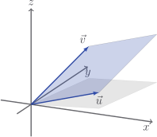
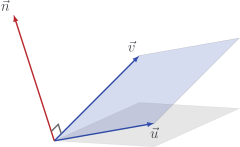

# Cross product in 3D

In $2$ dimensions, the magnitude of the cross product gave us the area of a
parallelogram:

$$
|\vec{u} \times \vec{v}| = |u_1 v_2 - u_2 v_1|
$$

In $3$ dimensions, this is also true. Two vectors

$$
\vec{u} = \begin{bmatrix} u_1 \\ u_2 \\ u_3 \end{bmatrix}
\quad
\vec{v} = \begin{bmatrix} v_1 \\ v_2 \\ v_3 \end{bmatrix}
$$

still determine a parallelogram, it just happens to be floating in space.



If we stare into the face of that parallelogram, we will find its area to be
$|\vec{u}||\vec{v}|\sin \theta$ just as in the $2$-dimensional case.

The nice formula $|u_1 v_2 - u_2 v_1|$ which calculates this area in $2$
dimensions has an equivalent in $3$ dimensions, but it isn't exactly pretty:

$$
|\vec{u} \times \vec{v}| = \sqrt{(u_2 v_3 - u_3 v_2)^2 + (u_3 v_1 - u_1 v_3)^2 + (u_1 v_2 - u_2 v_1)^2}
$$

Actually I take that back, it is quite pretty - it seems to contain within it a
few things which look like $2$-dimensional cross products. It's a sort of
parallelogram version of Pythagoras' Theorem.

::: details

In fact,

- $u_2 v_3 - u_3 v_2$ is the area of the "shadow" which the parallelogram casts
  onto the $yz$-plane

- $u_3 v_1 - u_1 v_3$ onto the $zx$-plane

- and $u_1 v_2 - u_2 v_1$ onto the $xy$-plane

So this is _very_ akin to Pythagoras, which relates the length of a line to the
shadows that line casts onto the $x$ and $y$ axes.

:::

If you just want to trust me that this does give the area of the parallelogram,
that's cool. If you're suspicious, open the panel below and behold.

::: details

Let $A$ be the area of the parallelogram, so

$$
A = |\vec{u}||\vec{v}|\sin\theta
$$

Remembering that $\sin^2 \theta = 1 - \cos^2 \theta$, we find that

$$
\begin{aligned}
A^2 & = |\vec{u}|^2 |\vec{v}|^2 \sin^2 \theta \\
& = |\vec{u}|^2 |\vec{v}|^2 \left(1 - \cos^2 \theta \right) \\
& = |\vec{u}|^2 |\vec{v}|^2 - \left( |\vec{u}||\vec{v}|\cos \theta \right)^2 \\
& = |\vec{u}|^2 |\vec{v}|^2 - \left(\vec{u} \cdot \vec{v} \right)^2 \\
& = \left( u_1^2 + u_2^2 + u_3^2 \right)\left( v_1^2 + v_2^2 + v_3^2 \right) - \left( u_1v_1 + u_2v_2 + u_3v_3 \right)^2 \\
& = u_1^2 v_1^2 + u_1^2 v_2^2 + u_1^2 v_3^2 + u_2^2 v_1^2 + u_2^2 v_2^2 + u_2^2 v_3^2 + u_3^2 v_1^2 + u_3^2 v_2^2 + u_3^2 v_3^2 \\
& - u_1^2 v_1^2 - u_2^2 v_2^2 - u_3^2 v_3^2 - 2\left( u_2v_2u_3v_3 + u_3v_3u_1v_1 + u_1v_1u_2v_2  \right) \\
& = u_2^2 v_3^2 + u_3^2 v_2^2 - 2 u_2 v_2 u_3 v_3 + u_3^2 v_1^2 + u_1^2 v_3^2 - 2 u_3 v_3 u_1 v_1 + u_1^2 v_2^2 + u_2^2 v_1^2 - 2 u_1v_1u_2v_2 \\
& = (u_2 v_3 - u_3 v_2)^2 + (u_3 v_1 - u_1 v_3)^2 + (u_1 v_2 - u_2 v_1)^2 \\
& = |\vec{u} \times \vec{v}|^2
\end{aligned}
$$

Now mop that sweat of your brow! We're done. We've got exactly what we want.

:::

I don't know who first thought to do this, but someone, somewhere, looked at
this formula and said... _hmm, what happens if we make this vector:_

$$
\vec{n} =
\begin{bmatrix}
u_2 v_3 - u_3 v_2 \\ u_3 v_1 - u_1 v_3 \\ u_1 v_2 - u_2 v_1
\end{bmatrix}
$$

Amazingly, it turns out that $\vec{n}$ is perpendicular to both $\vec{u}$ and
$\vec{v}$:



We can actually check to make sure that this $\vec{n}$ is perpendicular.
Remember the dot product? It is $0$ when vectors are perpendicular. If $\vec{n}$
truly is at $90$ degress to $\vec{u}$ and $\vec{v}$ then we should find that

$$
\begin{aligned}
\vec{u} \cdot \vec{n} & = 0 \\
\vec{v} \cdot \vec{n} & = 0
\end{aligned}
$$

Try it out if you like! I'll take care of $\vec{u} \cdot \vec{n}$ in the details
below if you want to have a peek.

::: details

The dot product gives us

$$
\begin{aligned}
\vec{u} \cdot \vec{n}
& = \begin{bmatrix} u_1 \\ u_2 \\ u_3 \end{bmatrix} \cdot \begin{bmatrix} u_2 v_3 - u_3 v_2 \\ u_3 v_1 - u_1 v_3 \\ u_1 v_2 - u_2 v_1 \end{bmatrix} \\
& = u_1(u_2 v_3 - u_3 v_2) + u_2(u_3 v_1 - u_1 v_3) + u_3(u_1 v_2 - u_2 v_1) \\
& = u_1 u_2 v_3 - u_1 u_3 v_2 + u_2 u_3 v_1 - u_2 u_1 v_3 + u_3 u_1 v_2 - u_3 u_2 v_1 \\
& = 0
\end{aligned}
$$

after carefully checking and cancelling terms. You can check similarly that
$\vec{v} \cdot \vec{n} = 0$.

:::

Not only that, but the magnitude of $\vec{n}$ is equal to

$$
|\vec{n}| = \sqrt{(u_2 v_3 - u_3 v_2)^2 + (u_3 v_1 - u_1 v_3)^2 + (u_1 v_2 - u_2 v_1)^2}
$$

That's the area $|\vec{u} \times \vec{v}|$ of our danged parallelogram!

::: tip

In $3$ dimensions, the cross product $\vec{u} \times \vec{v}$ is defined as the
vector

$$
\vec{u} \times \vec{v}
=
\begin{bmatrix}
u_2 v_3 - u_3 v_2 \\ u_3 v_1 - u_1 v_3 \\ u_1 v_2 - u_2 v_1
\end{bmatrix}
$$

This vector is perpendicular to both $\vec{u}$ and $\vec{v}$, and its magnitude
is equal to the parallelogram formed by $\vec{u}$ and $\vec{v}$.

:::

Now let's get this into `Vector` before my head explodes.

::: code-group

<<< @/../pycode/models/vector_test.py#test_vector_cross_product_3d

```python{1,8-13} [vector.py]
def cross(self, other: Vector) -> float | Vector:
    if not isinstance(other, Vector):
        return NotImplemented

    if len(self) == len(other) == 2:
        return self[0] * other[1] - other[0] * self[1]

    if len(self) == len(other) == 3:
        return Vector(
            self[1] * other[2] - self[2] * other[1],
            self[2] * other[0] - self[0] * other[2],
            self[0] * other[1] - self[1] * other[0],
        )
```

:::

## Exercise

<Exercise id="cross-product-3d" />
