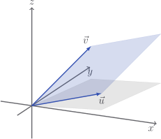
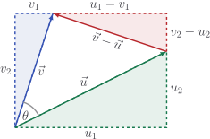

# The cross product

## Normal vectors

The cross product is a strange one: given vectors $\vec{u}$ and $\vec{v}$ in $3$
dimensions, it returns a vector $\vec{n} = \vec{u} \times \vec{v}$ which is
perpendicular (or _normal_) to both of them.

It turns out that the correct components for this vector are

$$
\vec{u} \times \vec{v} =
\begin{bmatrix}
u_2 v_3 - u_3 v_2 \\ u_3 v_1 - u_1 v_3 \\ u_1 v_2 - u_2 v_1
\end{bmatrix}
$$

We can check that this $\vec{u} \times \vec{v}$ is indeed perpendicular to both
$\vec{u}$ and $\vec{v}$.

::: details

The dot product gives us

$$
\begin{aligned}
\vec{u} \cdot \vec{n}
& = \begin{bmatrix} u_1 \\ u_2 \\ u_3 \end{bmatrix} \cdot \begin{bmatrix} u_2 v_3 - u_3 v_2 \\ u_3 v_1 - u_1 v_3 \\ u_1 v_2 - u_2 v_1 \end{bmatrix} \\[5pt]
& = u_1(u_2 v_3 - u_3 v_2) + u_2(u_3 v_1 - u_1 v_3) + u_3(u_1 v_2 - u_2 v_1) \\[5pt]
& = u_1 u_2 v_3 - u_1 u_3 v_2 + u_2 u_3 v_1 - u_2 u_1 v_3 + u_3 u_1 v_2 - u_3 u_2 v_1 \\[5pt]
& = 0
\end{aligned}
$$

after carefully checking and cancelling terms. You can check similarly that
$\vec{v} \cdot \vec{n} = 0$.

:::

## Parallelograms

Quite incredibly, the magnitude of the cross product

$$
|\vec{u} \times \vec{v}| = \sqrt{(u_2 v_3 - u_3 v_2)^2 + (u_3 v_1 - u_1 v_3)^2 + (u_1 v_2 - u_2 v_1)^2}
$$

also tells us the area of the parallelogram defined by $\vec{u}$ and $\vec{v}$.

::: details

Let

$$
A = |\vec{u}||\vec{v}|\sin\theta
$$

be the area of the parallelogram.

Remembering that $\sin^2 \theta = 1 - \cos^2 \theta$, we find that

$$
\begin{aligned}
A^2 & = |\vec{u}|^2 |\vec{v}|^2 \sin^2 \theta \\
& = |\vec{u}|^2 |\vec{v}|^2 \left(1 - \cos^2 \theta \right) \\
& = |\vec{u}|^2 |\vec{v}|^2 - \left( |\vec{u}||\vec{v}|\cos \theta \right)^2 \\
& = |\vec{u}|^2 |\vec{v}|^2 - \left(\vec{u} \cdot \vec{v} \right)^2 \\
& = \left( u_1^2 + u_2^2 + u_3^2 \right)\left( v_1^2 + v_2^2 + v_3^2 \right) - \left( u_1v_1 + u_2v_2 + u_3v_3 \right)^2 \\
& = \cancel{u_1^2 v_1^2} + u_1^2 v_2^2 + u_1^2 v_3^2 + u_2^2 v_1^2 + \cancel{u_2^2 v_2^2} + u_2^2 v_3^2 + u_3^2 v_1^2 + u_3^2 v_2^2 + \cancel{u_3^2 v_3^2} \\
& \quad - \cancel{u_1^2 v_1^2} - \cancel{u_2^2 v_2^2} - \cancel{u_3^2 v_3^2} - 2\left( u_2v_2u_3v_3 + u_3v_3u_1v_1 + u_1v_1u_2v_2  \right) \\
& = u_2^2 v_3^2 + u_3^2 v_2^2 - 2 u_2 v_2 u_3 v_3 + u_3^2 v_1^2 + u_1^2 v_3^2 - 2 u_3 v_3 u_1 v_1 + u_1^2 v_2^2 + u_2^2 v_1^2 - 2 u_1v_1u_2v_2 \\
& = (u_2 v_3 - u_3 v_2)^2 + (u_3 v_1 - u_1 v_3)^2 + (u_1 v_2 - u_2 v_1)^2 \\
& = |\vec{u} \times \vec{v}|^2
\end{aligned}
$$

Honestly the algebra here gets a bit meh. I enjoy it but if it's not your cup of
tea I get it.

:::

It's interesting to note that if $\vec{u}$ and $\vec{v}$ are parallel, then
$\vec{u} \times \vec{v}$ is full of zeros. This corresponds to the fact that
their parallelogram would have area $0$.

## In $2$ dimensions

Also interesting is that, if $\vec{u}$ and $\vec{v}$ are $2$-dimensional, we can
just let $u_3 = v_3 = 0$ in the cross product and everything still works. In
this case, we get

$$
\vec{u} \times \vec{v} =
\begin{bmatrix}
0 \\ 0 \\ u_1 v_2 - u_2 v_1
\end{bmatrix}
$$

and the area of the parallelogram is

$$
|\vec{u} \times \vec{v}| = |u_1 v_2 - u_2 v_1|
$$

This is a pretty famous formula in 2D geometry.

::: details

We compute the area of this rectangle in two ways. On the one hand, it is
obviously

$$
u_1 v_2
$$

On the other hand, we could add together the areas of the four triangles:

$$
\frac{|\vec{u}| |\vec{v}| \sin \theta}{2} + \frac{u_1 u_2}{2} + \frac{v_1 v_2}{2} + \frac{(u_1 - v_1)(v_2 - u_2)}{2}
$$

These quantities are equal, as they both represent the area, so

$$
\begin{aligned}
2 u_1 v_1 & = |\vec{u}| |\vec{v}| \sin \theta + u_1 u_2 + v_1 v_2 + (u_1 - v_1)(v_2 - u_2) \\
2 u_1 v_1 & = |\vec{u}| |\vec{v}| \sin \theta + \cancel{u_1 u_2} + \cancel{v_1 v_2} + u_1 v_2 - \cancel{u_1 u_2} - \cancel{v_1 v_2} + u_2 v_1 \\
2 u_1 v_1 & = |\vec{u}| |\vec{v}| \sin \theta + u_1 v_2 + u_2 v_1  \\
u_1 v_2 - u_2 v_1 & = |\vec{u}| |\vec{v}| \sin \theta
\end{aligned}
$$

Oh, hello!

:::

Right, let's get this into our class before my head explodes.

::: code-group

<<< @/../pycode/models/vector_test.py#test_vector_cross_product

<<< @/../pycode/models/vector.py#vector_cross_product

:::
