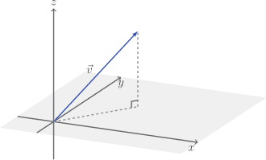

# Dimension

The **dimension** of a vector is just the number of components it has. The
vector

$$
\vec{v} = \begin{bmatrix}
x \\ y \\ z
\end{bmatrix}
$$

is $3$-dimensional, and can be drawn on $x, y, z$ axes.

We can even have $n$-dimensional vectors, with $n$ components. At this point, we
should give up on the alphabet and use subscript notation.

$$
\vec{v} = \begin{bmatrix}
v_1 \\ v_2 \\ \vdots \\ v_n
\end{bmatrix}
$$

## Code

Let's add a property to make sure we can get the dimension easily.

::: code-group

<<< @/../pycode/models/vector_test.py#test_vector_dimension

<<< @/../pycode/models/vector.py#vector_dimension

:::

## Exercise

<Exercise id="dimensions" />
