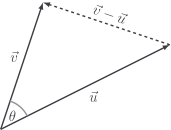

# Component formula

Who on earth has time for measuring the angle between two vectors? I don't even
own a protractor. Incredibly, the dot product is equal to the sum of the
components of the [Hadamard product](./hadamard-product):

$$
\vec{u} \cdot \vec{v} = u_1v_1 + u_2v_2 + \ldots + u_nv_n
$$

::: details

I'll do it for $2$ dimensions - the only difficulty in generalising is fiddling
with notation.

By subtracting the vectors and taking the magnitude, we see that

$$
\begin{aligned}
|\vec{v} - \vec{u}|^2
& = (v_1 - u_1)^2 + (v_2 - u_2)^2 \\
& = v_1^2 + u_1^2 - 2u_1v_1 + v_2^2 + u_2^2 - 2u_2v_2 \\
& = (u_1^2 + u_2^2) + (v_1^2 + v_2^2) - 2u_1v_1 - 2u_2v_2 \\
& = |\vec{u}|^2 + |\vec{v}|^2 - 2(u_1v_1 + u_2v_2)
\end{aligned}
$$

On the other hand, we have from the
[cosine rule](https://mathematico.netlify.app/pure/trigonometry/cos-rule/) that

$$
|\vec{v} - \vec{u}|^2 = |\vec{u}|^2 + |\vec{v}|^2 - 2|\vec{u}||\vec{v}| \cos \theta
$$

Both of these results equal $|\vec{v} - \vec{u}|^2$, and therefore they must be
equal to each other:

$$
\begin{aligned}
\cancel{|\vec{u}|^2} + \cancel{|\vec{v}|^2} - 2|\vec{u}||\vec{v}| \cos \theta & = \cancel{|\vec{u}|^2} + \cancel{|\vec{v}|^2} - 2(u_1v_1 + u_2v_2) \\
\cancel{- 2}|\vec{u}||\vec{v}| \cos \theta & = \cancel{- 2}(u_1v_1 + u_2v_2) \\
|\vec{u}||\vec{v}| \cos \theta & = u_1v_1 + u_2v_2 \\
\end{aligned}
$$

And holy shit if that isn't our dot product on the left side of the equation.

:::

This is _wonderful_, because it means we can compute $\vec{u} \cdot \vec{v}$
without even knowing the value of $\theta$. For example,

$$
\begin{aligned}
\begin{bmatrix} 1 \\ 3 \end{bmatrix} \cdot \begin{bmatrix} 4 \\ 2 \end{bmatrix}
& = 1 \cdot 4 + 3 \cdot 2 \\
& = 4 + 6 \\
& = 10
\end{aligned}
$$

## Code

When it comes to our `Vector` class, Python has the `@` infix which is
[intended to be used](https://peps.python.org/pep-0465/) for the dot product. To
implement it, we define the `__matmul__` dunder method.

::: code-group

<<< @/../pycode/models/vector_test.py#test_dot_product

<<< @/../pycode/models/vector.py#dot_product

:::

## Exercise

<Exercise id="dot-product-formula" />
