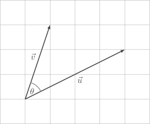
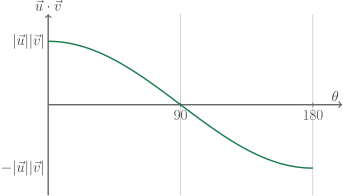

# Dot product

Mathematicians aren't all that interested in the Hadamard product, but they
absolutely trip over themselves when it comes to the **dot product**:

$$
\vec{u} \cdot \vec{v} = |\vec{u}| |\vec{v}| \cos \theta
$$

where $\theta$ (pronounced _theta_) is the angle between the vectors.



Here's how I think of this rule: we multiply the length of $\vec{u}$ with the
length of $\vec{v}$, then we scale them with the penalty factor $\cos \theta$
according to how perpendicular they are.



This is actually consistent with plain old regular numbers. With regular
numbers, we only have the options $\theta = 0$ (pointing in the same direction,
i.e. both positive or both negative) or $\theta = 180$ (pointing in the opposite
direction, i.e. one positive the other negative).

## Code

Nope! As we'll see in the next section, a bit of geometry allows us to implement
dot product without knowing $\theta$. Which is great news, because measuring
$\theta$ is a pain in the ass.

```py
def dot(u: Vector, v: Vector) -> float:
    raise NotImplementedError
```

## Exercise

<Exercise id="dot-product" />
