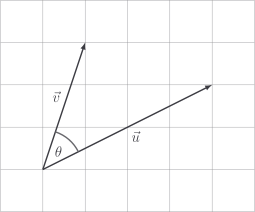

# Dot product

Multiplying a number by a number makes intuitive sense. Sally has $3$ bags with
$5$ apples in each. It's just repeated addition. Repeated addition of vectors
also leads us the scalar multiplication, which again is useful and intuitive -
it allows us to stretch vectors.

In summary, we can

- add a vector to a vector
- multiply a vector by a number

It begs the question: can we multiply a vector with a vector? The answer is...
_sort of_. Nobody can stop us making up any rules we want. There isn't some kind
of vector police. The only thing that really matters is: _is it useful_?

One useful rule we can make up is called the **dot product**, and it goes like
this:

$$
\vec{u} \cdot \vec{v} = |\vec{u}| |\vec{v}| \cos \theta
$$

where $\theta$ (pronounced _theta_) is the angle between the vectors.

Here's how I think of this rule: we multiply the length of $\vec{u}$ with the
length of $\vec{v}$, then we scale them with the penalty factor $\cos \theta$
according to how perpendicular they are.

- If $\vec{u}$ and $\vec{v}$ point in the same direction, then $\cos \theta$ is
  $1$, and so we're just multiplying the magnitudes.

- If they are perpendicular, then $\cos \theta$ is $0$ and the dot product is
  therefore also $0$. In a sense, the vectors don't cooperate at all.

- If the vectors point in opposite directions, the dot product ends up being
  negative.

This is a surprisingly useful concept. Amongst the many different candidates for
how we could define the "product" of two vectors, the dot product is one of the
best.

Even if you believe me that this $|\vec{u}| |\vec{v}| \cos \theta$ number is
useful, who on earth has time for measuring the angle between two vectors?
Nobody. Although this turns out to be a useful definition, computing it with the
formula $|\vec{u}| |\vec{v}| \cos \theta$ absolutely sucks. There's a trick,
which I will prove in the box below, which simplifies calculating the dot
product immensely.

::: details

By Pythagoras and a bit of algebra, we see that

$$
\begin{aligned}
|\vec{v} - \vec{u}|^2
& = (v_1 - u_1)^2 + (v_2 - u_2)^2 \\
& = v_1^2 + u_1^2 - 2u_1v_1 + v_2^2 + u_2^2 - 2u_2v_2 \\
& = (u_1^2 + u_2^2) + (v_1^2 + v_2^2) - 2u_1v_1 - 2u_2v_2 \\
& = |\vec{u}|^2 + |\vec{v}|^2 - 2(u_1v_1 + u_2v_2)
\end{aligned}
$$

On the other hand, we have from the
[cosine rule](https://mathematico.netlify.app/pure/trigonometry/cos-rule/) that

$$
|\vec{v} - \vec{u}|^2 = |\vec{u}|^2 + |\vec{v}|^2 - 2|\vec{u}||\vec{v}| \cos \theta
$$

Both of these results equal $|\vec{v} - \vec{u}|^2$, and therefore they must be
equal to each other:

$$
\begin{aligned}
|\vec{u}|^2 + |\vec{v}|^2 - 2|\vec{u}||\vec{v}| \cos \theta & = |\vec{u}|^2 + |\vec{v}|^2 - 2(u_1v_1 + u_2v_2) \\
- 2|\vec{u}||\vec{v}| \cos \theta & = - 2(u_1v_1 + u_2v_2) \\
|\vec{u}||\vec{v}| \cos \theta & = u_1v_1 + u_2v_2 \\
\end{aligned}
$$

And holy shit if that isn't our dot product on the left side of the equation.

:::

So here it is:

$$
\vec{u} \cdot \vec{v} = u_1 v_1 + u_2 v_2
$$

Now we can very easily compute, for example,

$$
\begin{aligned}
\begin{bmatrix} 1 \\ 3 \end{bmatrix} \cdot \begin{bmatrix} 4 \\ 2 \end{bmatrix}
& = 1 \times 4 + 3 \times 2 \\
& = 4 + 6 \\
& = 10
\end{aligned}
$$

We won't go to the same effort to prove it, but this works in $3$ dimensions

$$
\vec{u} \cdot \vec{v} = u_1 v_1 + u_2 v_2 + u_3 v_3
$$

And higher dimensions, too

$$
\vec{u} \cdot \vec{v} = u_1 v_1 + u_2 v_2 + \ldots + u_n v_n
$$

::: tip

The dot product of two vectors is defined by

$$
\vec{u} \cdot \vec{v} = |\vec{u}||\vec{v}| \cos \theta
$$

It may be calculated using the alternative formula

$$
\vec{u} \cdot \vec{v} = u_1 v_1 + u_2 v_2 + \ldots + u_n v_n
$$

:::

When it comes to our `Vector` class, Python has the `@` infix which is
[intended to be used](https://peps.python.org/pep-0465/) for the dot product. To
implement it, we override the `__matmul__` dunder method.

::: code-group

<<< @/../pycode/models/vector_test.py#test_dot_product

<<< @/../pycode/models/vector.py#dot_product

:::

## Exercise

<Exercise id="dot-product" />
