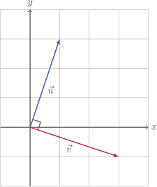

# Orthogonality

Forgive the pompous name. Orthogonal, normal, and perpendicular all just mean
the same thing: the vectors are at $90^{\circ}$ to each other.

The point is, that two vectors $\vec{u}$ and $\vec{v}$ are orthogonal if, and
only if

$$
\vec{u} \cdot \vec{v} = 0
$$

::: tip

Two vectors $\vec{u}$ and $\vec{v}$ are orthogonal if, and only if

$$
\vec{u} \cdot \vec{v} = 0
$$

:::

This is because the $\cos \theta$ part of the dot product is $0$ only when
$\theta$ is a multiple of $90^{\circ}$.

In two dimensions, if we look at the component formula

$$
u_1 v_1 + u_2 v_2 = 0
$$

we can see that this will be true when

$$
\vec{v} = \begin{bmatrix} u_2 \\ - u_1 \end{bmatrix}
$$

which, if you count the squares in the image above, checks out:

$$
\begin{bmatrix} 1 \\ 3 \end{bmatrix}
\cdot
\begin{bmatrix} 3 \\ -1 \end{bmatrix}
= 3 - 3
= 0
$$

## Code

Let's add a method to return the perpendicular to a given $2$-dimensional
vector.

::: code-group

<<< @/../pycode/models/vector_test.py#test_vector_perp

<<< @/../pycode/models/vector.py#vector_perp

:::

This isn't the _only_ perpendicular vector, but it is true that any
perpendicular vector must be some multiple of `u.perp()`.

If the dimension is higher than $2$, then there are multiple directions
perpendicular to $\vec{u}$ and it isn't clear which one to choose. Let's not
worry about it right now - it's a whole thing. We'll discuss it soon.

## Exercise

<Exercise id="" />
