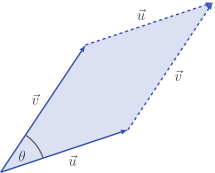

# Parallelograms

Given two vectors, we can create a parallelogram like this:

The area of the parallelogram can be found, through elementary geometry, to be

$$
\text{Area} = |\vec{u}| |\vec{v}| \sin \theta
$$

I still can't find my protractor. Fortunately, I don't need it, because this
area can be expressed purely in terms of the components of the vectors! It is

$$
\text{Area} = \sqrt{ (\vec{u} \cdot \vec{u}) (\vec{v} \cdot \vec{v}) - (\vec{u} \cdot \vec{v})^2}
$$

::: details

Remembering that $\sin^2 \theta = 1 - \cos^2 \theta$, we find that

$$
\begin{aligned}
\text{Area}^2 & = |\vec{u}|^2 |\vec{v}|^2 \sin^2 \theta \\
& = |\vec{u}|^2 |\vec{v}|^2 \left(1 - \cos^2 \theta \right) \\
& = |\vec{u}|^2 |\vec{v}|^2 - \left( |\vec{u}||\vec{v}|\cos \theta \right)^2 \\
& = (\vec{u} \cdot \vec{u}) (\vec{v} \cdot \vec{v}) - \left(\vec{u} \cdot \vec{v} \right)^2 \\
\end{aligned}
$$

:::

The code for this formula basically writes itself, because we have already
implemented the algebra required to express it.

::: code-group

<<< @/../pycode/models/vector_test.py#test_vector_area

<<< @/../pycode/models/vector.py#vector_area

:::

The special cases in $2$ and $3$ dimensions deserve a bit of attention.

## $2$ dimensions

If the vectors are $2$-dimensional, this formula simplifies to

$$
\text{Area} = |u_1 v_2 - u_2 v_1|
$$

::: details

We have

$$
\begin{aligned}
\text{Area}^2
& = (\vec{u} \cdot \vec{u}) (\vec{v} \cdot \vec{v}) - (\vec{u} \cdot \vec{v})^2 \\
& = (u_1^2 + u_2^2)(v_1^2 + v_2)^2 - (u_1 v_1 + u_2 v_2)^2 \\
& = \cancel{u_1^2 v_1^2} + u_1^2 v_2^2 + u_2^2 v_1^2 + \cancel{u_2^2 v_2^2}
- \cancel{u_1^2 v_1^2} - 2 u_1 v_2 u_2 v_1 - \cancel{u_2^2 v_2^2} \\
& = (u_1 v_2 - u_2 v_1)^2
\end{aligned}
$$

and taking square roots, we're left with

$$
\begin{aligned}
\text{Area}
& = \sqrt{(u_1 v_2 - u_2 v_1)^2} \\
& = |u_1 v_2 - u_2 v_1|
\end{aligned}
$$

:::

This is a pretty famous formula and is used all the time in things like computer
graphics.

## $3$ dimensions

If the vectors are $3$-dimensional, we can visualise the parallelogram floating
in space.

The area formula becomes

$$
\text{Area} = \sqrt{(u_2 v_3 - u_3 v_2)^2 + (u_3 v_1 - u_1 v_3)^2 + (u_1 v_2 - u_2 v_1)^2}
$$

I only mention this because it is the magnitude of the normal vector calculated
by the cross product!

$$
\text{Area} = | \vec{u} \times \vec{v} |
$$

::: details

Get ready...

$$

\begin{aligned}
\text{Area}^2
& = |\vec{u}|^2 |\vec{v}|^2 - \left(\vec{u} \cdot \vec{v} \right)^2 \\

& = \left( u_1^2 + u_2^2 + u_3^2
\right)\left( v_1^2 + v_2^2 + v_3^2 \right) - \left( u_1v_1 + u_2v_2 + u_3v_3
\right)^2 \\

& = \cancel{u_1^2 v_1^2} + u_1^2 v_2^2 + u_1^2 v_3^2 + u_2^2
v_1^2 + \cancel{u_2^2 v_2^2} + u_2^2 v_3^2 + u_3^2 v_1^2 + u_3^2 v_2^2 +
\cancel{u_3^2 v_3^2} \\

& \quad - \cancel{u_1^2 v_1^2} - \cancel{u_2^2 v_2^2} -
\cancel{u_3^2 v_3^2} - 2\left( u_2v_2u_3v_3 + u_3v_3u_1v_1 + u_1v_1u_2v_2
\right) \\ & = u_2^2 v_3^2 + u_3^2 v_2^2 - 2 u_2 v_2 u_3 v_3 + u_3^2 v_1^2 +
u_1^2 v_3^2 - 2 u_3 v_3 u_1 v_1 + u_1^2 v_2^2 + u_2^2 v_1^2 - 2 u_1v_1u_2v_2 \\

& = (u_2 v_3 - u_3 v_2)^2 + (u_3 v_1 - u_1 v_3)^2 + (u_1 v_2 - u_2 v_1)^2 \\

& = | \vec{u} \times \vec{v} |^2
\end{aligned}
$$

Phew!

:::

## Exercise

<Exercise id="parallelograms" />
