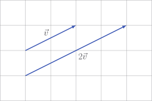
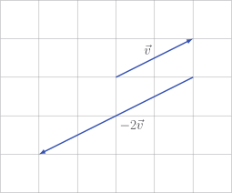

# Scaling vectors

I hope it isn't too controversial to write

$$
\vec{v} + \vec{v} = 2 \vec{v}
$$

Even without knowing that multiplying a vector by a number is allowed, I think
we can all look at the above equation with warmth in our hearts, knowing that -
whatever might be going on in the world - this little row of symbols makes total
sense.

What we've done is known as **scalar multiplication**. Scalar is just a dumb
word for number. It works like this:

$$
2 \begin{bmatrix} 3 \\ 1 \end{bmatrix} = \begin{bmatrix} 6 \\ 2 \end{bmatrix}
$$

As a general rule,

$$
\lambda \begin{bmatrix} v_1 \\ v_2 \\ \vdots \\ v_n  \end{bmatrix}
= \begin{bmatrix} \lambda v_1 \\ \lambda v_2 \\ \vdots \\ \lambda v_n \end{bmatrix}
$$

::: tip

$\lambda$ is the Greek letter _lambda_. We use Greek letters often. It makes me
feel fancy.

:::

If we remember the "just glue them together" principle from
[adding vectors](./adding-vectors#visual-interpretation), we might realise
before drawing anything that multiplying $\vec{v}$ by $\lambda$ sort of
stretches the arrow $\vec{v}$ by $\lambda$. Or, we might not. It doesn't matter
because we're about to draw something anyway.



Multiplying by a negative number will reverse the direction of $\vec{v}$.



In words,

- $\vec{v}$ says _go right by two and up by one_
- therefore $-2\vec{v}$ says _go left by four and down by two_

## Code

To implement this in `Vector`, we will use the `__mul__` method to override the
`*` operator.

::: code-group

<<< @/../pycode/models/vector_test.py#test_vector_scalar_multiplication

```py [vector.py]
def __mul__(self, scalar: float) -> Vector:
    if isinstance(scalar, (int, float)):
        return Vector(x * scalar for x in self)

    return NotImplemented

__rmul__ = __mul__

def __truediv__(self, scalar: float) -> Vector:
    return (1 / scalar) * self
```

:::

## Exercise

<Exercise id="scaling-vectors" />
