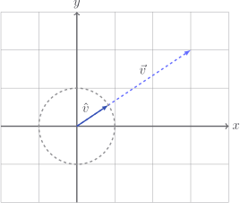

# Unit vectors

The number $1$ is, all things considered, pretty useful. There isn't a person
alive whose day wouldn't be ruined if the number $1$ didn't exist.

As far as numbers are concerned, $1$ and $-1$ are _units_. They both have a
length of $1$. A **unit vector** is just any vector whose magnitude is $1$.

$$
\begin{bmatrix}
1 \\ 0
\end{bmatrix}

\quad

\begin{bmatrix}
0 \\ 1
\end{bmatrix}

\quad

\begin{bmatrix}
0.6 \\
0.8
\end{bmatrix}
$$

The first two are almost silly - the last one at least has a wiff of integrity.
Let's make sure it really is a unit vector:

$$
\begin{aligned}
\left| \vec{v} \right|
& = \sqrt{0.6^2 + 0.8^2} \\
& = \sqrt{0.36 + 0.64} \\
& = \sqrt{1} \\
& = 1
\end{aligned}
$$

You're probably suspicious of how I cooked up this example. Let's share the
trick. We divide the vector by it's own magnitude, and _hey presto_ it's a unit
vector.

Say we want to make

$$
\begin{bmatrix}
12 \\ 5
\end{bmatrix}
$$

into a unit vector. Well we calculate it's own length

$$
\sqrt{12^2 + 5^2} = 13
$$

and divide:

$$
\frac{1}{13} \begin{bmatrix}
12 \\ 5
\end{bmatrix}
=
\begin{bmatrix}
\frac{12}{13} \\ \frac{5}{13}
\end{bmatrix}
\approx
\begin{bmatrix}
0.923 \\ 0.385
\end{bmatrix}
$$

This, I guarantee you, is a unit vector. Go ahead and hit it with Pythagoras -
it'll be near as damnit $1$.

We'll add a method to our class to create a unit vector from any given vector.

::: code-group

<<< @/../pycode/models/vector_test.py#test_vector_unit

<<< @/../pycode/models/vector.py#vector_unit

:::

I'll use $\hat{v}$ if we ever need to specify that a vector is a unit.

So what we've been saying in this page is

$$
\hat{v} = \frac{\vec{v}}{|\vec{v}|}
$$

Geometrically, $\hat{v}$ has the same direction as $\vec{v}$, but lies on the
unit circle (assuming we draw from the origin).

## Exercise

<Exercise id="unit-vectors" />
