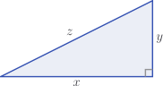
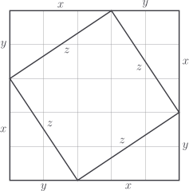
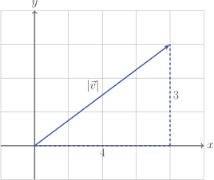

# Vector magnitude

Some vectors are big; some vectors are small. That's ok. But for the good of
science we'd like to assign a number to measure the size.

To do this, we might remember a little fact about triangles known as Pythagoras'
theorem.

The fact is that

$$
z = \sqrt{x^2 + y^2}
$$

If you have never seen a proof, my personal favourite is given below.

::: details

The area of the above image can be found in two ways.

First, by summing the area of the four triangles plus the square in the middle:

$$
\begin{aligned}
& z^2 + 4 \times \frac{xy}{2} \\
= {} & z^2 + 2xy
\end{aligned}
$$

Second, by multiplying the overall height by the overall width:

$$
\begin{aligned}
& (x + y)^2 \\
= {} & x^2 + y^2 + 2xy
\end{aligned}
$$

As these expressions both equal the area, they must equal each other, and so

$$
\begin{aligned}
z^2 + \cancel{2xy} & = x^2 + y^2 + \cancel{2xy} \\
z^2 & = x^2 + y^2
\end{aligned}
$$

:::

We denote the magnitude (that is to say, the length) of $\vec{v}$ by
$|\vec{v}|$. So just how long is the vector

$$
\vec{v} = \begin{bmatrix} 4 \\ 3 \end{bmatrix}?
$$

Let's draw the thing

Now, we see very clearly by Pythagoras' theorem that

$$
\begin{aligned}
|\vec{v}|
& = \sqrt{4^2 + 3^2} \\
& = \sqrt{25} \\
& = 5 \\
\end{aligned}
$$

Generally, we define

$$
|\vec{v}| = \sqrt{v_1^2 + v_2^2 + \ldots + v_n^2}
$$

Let's implement this in our `Vector` class. We'll override `__abs__` because
"absolute value" means the size of the thing, irrespective of direction.

::: code-group

<<< @/../pycode/models/vector_test.py#test_vector_magnitude

<<< @/../pycode/models/vector.py#vector_magnitude

:::

## Exercise

<Exercise id="vector-magnitude" />
